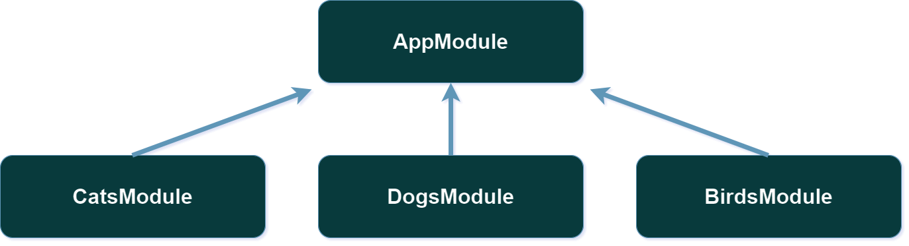

# Modules

## Table of Contents

- [Introduction](#introduction)
- [Imports](#imports)
- [Providers](#providers)
- [Exports](#exports)
- [ModuleContainer](#modulecontainer)
  - [Get the Container of a Module](#get-the-container-of-a-module)
  - [ModuleContainer API](#modulecontainer-api)

## Introduction

A module is a class annotated with a `@module()` decorator. The `@module()` decorator provides metadata that is used to organize the dependency system.

Each application has at least one module, a root module. The root module is normally called `AppModule` and is the starting point used to build the dependencies tree. While very small applications may theoretically have just the root module, for most applications, the resulting architecture will employ multiple modules, each encapsulating a closely related set of capabilities.

```typescript
import { module } from "inversiland";
import CatsModule from "./cats/CatsModule";
import DogsModule from "./dogs/DogsModule";
import BirdsModule from "./birds/BirdsModule";

@module({
  imports: [CatsModule, DogsModule, BirdsModule],
  providers: [],
  exports: [],
})
export class AppModule {}
```

The relationship between modules would be as follows:

</br>

<div align="center">

</div>

</br>

Once `AppModule` is defined, we will only have to call the `Inversiland.run` method specifying the root module:

```typescript
import { Inversiland } from "inversiland";
import { AppModule } from "./AppModule";

Inversiland.run(AppModule);
```

The module decorator accepts an object argument with the `imports`, `providers` and `exports` properties.

Next we will explain what each of these properties is for.

## Imports

The list of imported modules that export the providers which are required in this module.

```typescript
@module({
  imports: [CatsModule],
})
export class AppModule {}
```

You can also use the `forRoot` pattern to generate [dynamic modules](#dynamic-modules) in the air and inject a configuration into the container.

The following example illustrates how we could inject a [Mongoose](https://mongoosejs.com/) database connection asynchronously from the options we pass as a parameter to the static `forRoot` method.

```typescript
@module({})
export default class MongooseModule {
  static forRoot(config: MongooseConnectionConfig): DynamicModule {
    const { uri, options } = config;

    return {
      module: MongooseModule,
      providers: [
        {
          provide: MongooseConnectionToken,
          useAsyncFactory: () => async () => {
            if (!mongoose.connection || mongoose.connection.readyState === 0) {
              await mongoose.connect(uri, options);
            }

            return mongoose.connection;
          },
          isGlobal: true,
        },
        {
          provide: MongooseConnectionConfigToken,
          useValue: config,
          isGlobal: true,
        },
      ],
    };
  }
}
```

Now we just need to import the dynamic module into the `AppModule` to globally provide the database connection and configuration.

```typescript
@module({
  imports: [MongooseModule.forRoot({ uri: process.env.MONGO_URI })],
})
export class AppModule {}
```

## Providers

The providers that will be instantiated when the module is registered. These providers may be shared at least across this module.

You can define a provider in different ways depending on the desired instantiation method.

```typescript
@module({
  providers: [
    CatsService,
    {
      provide: CatsServiceToken,
      useClass: CatsService,
    },
    {
      provide: CatNameToken,
      useValue: "Toulouse",
    },
    {
      provide: CatNameFactoryToken,
      useFactory:
        (context) =>
        (...args) =>
          "New name",
    },
    {
      provide: Symbol(),
      useAsyncFactory: () => async () => {
        if (!mongoose.connection || mongoose.connection.readyState === 0) {
          await mongoose.connect(uri, options);
        }

        return mongoose.connection;
      },
    },
    {
      provide: "CATS_SERVICE_ALIAS",
      useExisting: CatsServiceToken,
    },
  ],
})
export class CatsModule {}
```

You can also add the `onActivation` and `onDeactivation` handlers to providers that need it. Check the [activation handler](https://github.com/inversify/InversifyJS/blob/master/wiki/activation_handler.md) and [deactivation handler](https://github.com/inversify/InversifyJS/blob/master/wiki/deactivation_handler.md) sections of Inversify documentation for more information.

> ⚠️ Remember that the `onDeactivation` handler will throw an error if we try to define it in a provider that does not have singleton scope.

## Exports

The subset of providers that will be e available in other modules which import this module. You can use either a `ExportedProvider` object or just its token (provide value).

If you export a provider with an injection token that is not registeres as a provider, an error will be thrown.

```typescript
@module({
  providers: [
    CatsService,
    {
      provide: CatNameToken,
      useValue: "Toulouse",
    },
  ],
  exports: [TestService, CatNameToken],
})
export class CatsModule {}
```

And you'll only need to change the decorator to `@multiInject` if you export more than one provider with the same `ServiceIdentifier`.

```typescript
@module({
  providers: [
    {
      provide: CatNameToken,
      useValue: "Toulouse",
    },
    {
      provide: CatNameToken,
      useValue: "Tomas O'Malley",
    },
    {
      provide: CatNameToken,
      useValue: "Duchess",
    },
  ],
  exports: [
    {
      provide: CatNameToken,
    },
  ],
})
export class CatsModule {}
```

```bash
@multiInject(CatNameToken) = ["Toulouse", "Tomas O'Malley", "Duchess"]
```

And if you want to re-export providers with an identifier that have been imported into a module you must add the `deep` property.

```typescript
@module({
  providers: [
    {
      provide: CatNameToken,
      useValue: "Toulouse",
    },
    {
      provide: CatNameToken,
      useValue: "Tomas O'Malley",
    },
    {
      provide: CatNameToken,
      useValue: "Duchess",
    },
  ],
  exports: [
    {
      provide: CatNameToken,
    },
  ],
})
export class CatsModule {}

@module({
  imports: [CatsModule],
  providers: [
    {
      provide: CatNameToken,
      useValue: "Félix",
    },
  ],
  exports: [
    {
      provide: CatNameToken,
      deep: true,
    },
  ],
})
export class MoreCatsModule {}
```

```bash
@multiInject(CatNameToken) = ["Toulouse", "Tomas O'Malley", "Duchess", "Félix"]
```

## ModuleContainer

### Get the Container of a Module

**Ideally we shouldn't be accessing module containers directly to get a service**. In either case, the `getModuleContainer` function allows you to get the container of a module in case you need to access it in an statement.

```typescript
import {
  getModuleContainer,
  module,
  injectable,
  Inversiland,
} from "inversiland";

@injectable()
class ProvidedService {}

@injectable()
class ExportedService {}

@module({
  providers: [ProvidedService, ExportedService],
  exports: [ExportedService],
})
class AModule {}

@module({
  imports: [AModule],
})
class AppModule {}

Inversiland.run(AppModule);

// Accessing the container of a module
const appModuleContainer = getModuleContainer(AppModule);
const testModuleContainer = getModuleContainer(TestModule);

// Getting a service provided or imported
const providedService = testModuleContainer.get(ProvidedService);
const importedService = appModuleContainer.get(ImportedService);

// Getting a service locally provided to module
const providedService = testModuleContainer.getProvided(ProvidedService);

// Getting a service imported from a module to another
const importedService = appModuleContainer.getImported(ImportedService);
```

The container returned by the `getModuleContainer()` function is a wrapper of the Inversify's `Container` class that exposes only the necessary methods to access dependencies in both the providers section of the container and the container section of services imported by other modules.

### ModuleContainer API

```typescript
get innerContainer(): Container
```

```typescript
isBound(serviceIdentifier: interfaces.ServiceIdentifier<T>): boolean
```

```typescript
isCurrentBound(serviceIdentifier: interfaces.ServiceIdentifier<T>): boolean
```

```typescript
isProvided(serviceIdentifier: interfaces.ServiceIdentifier<T>): boolean
```

```typescript
isCurrentProvided(serviceIdentifier: interfaces.ServiceIdentifier<T>): boolean
```

```typescript
isImported(serviceIdentifier: interfaces.ServiceIdentifier<T>): boolean
```

```typescript
isCurrentImported(serviceIdentifier: interfaces.ServiceIdentifier<T>): boolean
```

```typescript
bindProvider(provider: Provider): void
```

```typescript
copyBindings(container: ModuleContainer, serviceIdentifiers: interfaces.ServiceIndentifier[], constraint?: interfaces.ConstraintFunction): void
```

```typescript
get<T = unknown>(serviceIdentifier: interfaces.ServiceIdentifier<T>): T
```

```typescript
getAll<T = unknown>(serviceIdentifier: interfaces.ServiceIdentifier<T>): T
```

```typescript
getProvided<T = unknown>(serviceIdentifier: interfaces.ServiceIdentifier<T>): T
```

```typescript
getAllProvided<T = unknown>(serviceIdentifier: interfaces.ServiceIdentifier<T>): T[]
```

```typescript
getImported<T = unknown>(serviceIdentifier: interfaces.ServiceIdentifier<T>): T | T[]
```

```typescript
getAllImported<T = unknown>(serviceIdentifier: interfaces.ServiceIdentifier<T>): T[]
```

```typescript
unbindAll(): void
```
